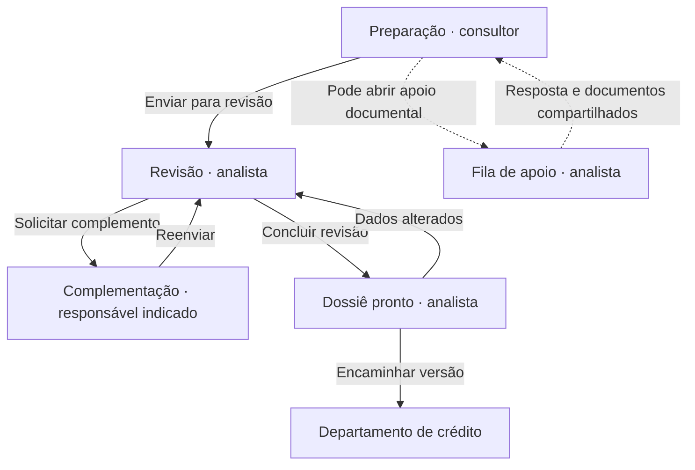
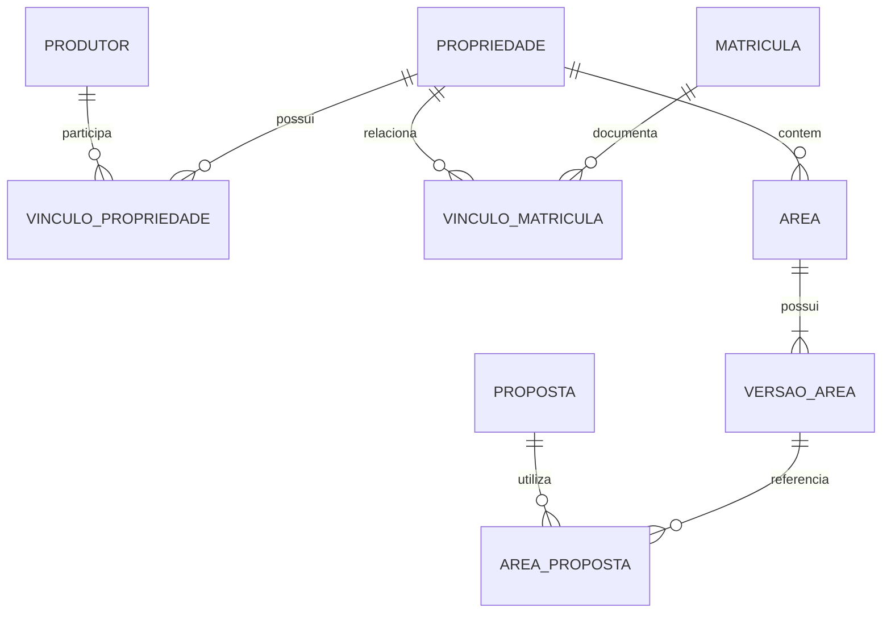

# DCREDC149 — Gestão de propostas de crédito rural

Especificação funcional e técnica • versão 1.0 • 6 de setembro de 2026

**Estado desta entrega:** projeto da evolução, pronto para orientar implementação e validação. Este documento não representa funcionalidades já publicadas. Base examinada: commit `b4f764cd4815eb7cecf9f6f067273cb79483af27` do [DCREDC149](https://github.com/lucasfelipe131/DCREDC149).

## 1. Objetivo e decisões

Reunir cadastro, levantamento de campo, matrículas, documentação, revisão e encaminhamento em uma base compartilhada. Cada proposta deve mostrar sua etapa, responsável, pendências e próxima ação. O crédito recebe uma versão preservada do dossiê revisado.

Classificação usada neste documento:

- **Definido:** requisito apresentado pelo solicitante.
- **Proposto:** solução de produto, implementação ou permissão sugerida para validação.
- **Em aberto:** regra que não foi definida e não deve ser ativada por suposição.

| Tema | Definido | Proposto ou em aberto |
|---|---|---|
| Responsabilidades | Consultor faz levantamento e solicitação; analista mantém matrículas e organiza o dossiê; gerente acompanha; crédito acessa o material revisado | Escopo exato por carteira, unidade e campo, detalhado na seção 6 |
| Interface | Português, pendências, responsáveis e próximos passos visíveis | Preservar o menu azul-escuro, as etapas no topo e o espaço central de mapas do layout atual; adaptar navegação aos quatro perfis |
| Cadastro | Base comum, sem redigitação de dados já cadastrados | Identificadores estáveis, vínculos relacionais e processo assistido de conciliação de duplicidades |
| Geografia | Polígonos, vértices, hectares totais e cultiváveis, culturas e área plantada | PostGIS; desenho e edição manual; importação inicial de GeoJSON/KML; outros formatos em etapa posterior |
| Garantias | Indicar áreas para análise, separadamente da aceitação | Registrar tipo e bem apresentado, recorte espacial, origem e documentos; não gerar avaliação de elegibilidade |
| Fluxo | Preparação → revisão → complementação quando necessária → dossiê pronto → crédito | Estados técnicos, controle de concorrência e devoluções descritos na seção 3 |
| Relatórios | Visão da unidade e separação entre hectares associados e únicos | Filtros, fórmulas e tratamento temporal iniciais na seção 9 |
| Decisão do crédito | Acesso ao dossiê revisado | Aprovação, recusa, alçadas, valores aprováveis, documentos obrigatórios por operação e critérios de garantia continuam em aberto |

### Situação atual e reaproveitamento

| Base existente | Evolução necessária |
|---|---|
| React, API Node e PostgreSQL, hospedados na Railway | Manter a aplicação e planejar extensão espacial do banco; verificar suporte e migração antes de alterar a instância |
| Produtores, propriedades e propostas persistidos | Introduzir unidades, responsáveis, vínculos entre produtores e propriedades e revisões dos cadastros |
| Três papéis: `admin`, `analyst`, `viewer` | Quatro perfis de negócio e administração técnica separada, com autorização por ação, campo e escopo |
| Uma coordenada de localização e matrícula em campo textual | Áreas com polígonos versionados; matrículas como registros próprios com documentos e vínculos |
| Upload, extração de texto/OCR, conferência humana e histórico | Acervo compartilhado de documentos, versões e vínculos reutilizáveis entre propostas |
| Análises financeiras e pareceres registrados | Preservar a origem desses registros; separar cálculo, revisão documental e decisão de crédito |
| Dossiê para impressão com dados da solicitação | Mapa e memorial reproduzíveis, arquivos congelados, manifesto de versões e protocolo de encaminhamento |

O parecer favorável/desfavorável existente não deve ser convertido automaticamente em aprovação/recusa do departamento de crédito. A migração deve preservar o histórico como parecer do fluxo anterior, manter as análises identificadas pela metodologia utilizada e retirar esse comando da nova etapa de crédito até que suas regras sejam definidas. **Essa alteração de comportamento ainda não foi executada.**

## 2. Estrutura de telas

### Organização comum

Cabeçalho: unidade em uso, perfil efetivo, usuário e pesquisa. Menu lateral: Painel, Propostas, Produtores, Propriedades e áreas, Matrículas, Documentos, Apoio documental e Relatórios, conforme permissões.

Na proposta, manter a sequência de etapas no topo. Abaixo: produtor, responsável, próxima ação e indicadores de hectares. No corpo: mapa e informações da área selecionada; documentação e pendências ao lado ou abaixo, conforme a largura da tela. Abas: Resumo, Produtor, Propriedades e áreas, Culturas, Matrículas, Documentos, Pendências, Dossiê e Histórico.

Etapa do processo e situação das pendências são informações diferentes: uma proposta pode estar “Em revisão” e ter três pendências. Não criar uma etapa genérica “Com pendência” que apague o momento do fluxo.

| Tela | Conteúdo e ações | Próximo passo visível |
|---|---|---|
| Painel do consultor | Minhas propostas, complementações recebidas, apoios documentais, hectares e últimas movimentações; nova proposta | Completar levantamento, responder pendência ou enviar à revisão |
| Painel do analista | Fila de revisão e fila de apoio separadas; responsável, idade do item, divergências e documentos aguardados | Assumir atendimento, conferir documento, pedir complemento ou preparar dossiê |
| Painel do gerente | Propostas da unidade por etapa, propostas com pendências, dossiês prontos/encaminhados, hectares e tempos | Abrir a proposta ou o grupo responsável pelo acúmulo |
| Caixa do departamento de crédito | Dossiês encaminhados; unidade, produtor, consultor, analista, data e versão | Abrir dossiê e consultar anexos/histórico; sem botão de concessão de crédito |
| Produtor | Identificação, contato, município, propriedades vinculadas, propostas e documentos acessíveis | Completar cadastro ou usar o cadastro existente |
| Propriedade | Nome, município/UF, localização, área declarada, produtores relacionados e tipo de vínculo, matrículas, áreas e histórico | Mapear áreas, comprovar vínculo ou pedir apoio |
| Editor de áreas | Desenho/edição de polígonos, tabela dos vértices, área calculada, partes cultiváveis, fontes, versões e comparação | Corrigir geometria, classificar área ou vincular matrícula |
| Culturas e safra | Cultura, safra/período, área de plantio, hectares declarados e, quando disponível, recorte plantado | Completar levantamento e justificar divergências |
| Matrículas | Cartório, identificadores, área documental, titulares conforme documento, atos/ônus transcritos, certidões e vínculos | Analista cadastra/confere; consultor consulta ou solicita correção |
| Central documental | Originais, versões, categoria, fonte, emissão, validade informada, extração, conferência e vínculos | Conferir original, corrigir sugestão de leitura ou anexar nova versão |
| Apoio documental | Pedido, produtor/propriedade, matrícula se conhecida, proposta opcional, solicitante, atendente, mensagens e anexos | Atender, fornecer informação ou devolver resposta ao solicitante |
| Revisão da unidade | Cadastro, mapa, documentos e divergências lado a lado; checklist e campos revisados | Corrigir com justificativa, devolver itens ao consultor ou marcar dossiê pronto |
| Dossiê e memorial | Prévia paginada, índice, mapa, tabela de vértices, áreas, matrículas, documentos e pendências | Revisar prévia, exportar rascunho ou encaminhar a versão revisada |
| Relatórios | Filtros, contagens, áreas associadas/únicas e tempos; detalhamento até a proposta/área de origem | Identificar pendências e responsáveis |
| Administração técnica | Usuários, vínculos com unidades, perfis e registros técnicos, sem alçada de negócio implícita | Manter os acessos aprovados |

### Comportamentos da interface

- Cada pendência mostra: o que falta/diverge, entidade/campo relacionado, fonte, responsável e ação para resolver. Prazo aparece somente se informado ou se uma regra validada o definir.
- Estados vazios exibem “Ainda não cadastrado”, “Não informado” ou “Não consultado”. Falha de leitura não vira “Documento sem dados”; fonte externa indisponível não vira “Regular”.
- Matrícula cadastrada pelo analista fica imediatamente consultável nos registros autorizados do consultor. O consultor não precisa criar uma cópia.
- Coordenadas também podem ser digitadas em tabela; mapas não são o único meio de interação. Usar rótulos além das cores, foco por teclado e mensagens de erro junto aos campos.
- Dados de demonstração devem permanecer isolados e identificados. Nenhum produtor, documento, polígono, safra ou indicador fictício entra na base operacional.

## 3. Fluxo e responsáveis

| Estado proposto | Responsável | Operações permitidas e saída |
|---|---|---|
| `preparacao` | Consultor responsável | Cadastrar, mapear, anexar e pedir apoio; enviar a revisão mesmo com pendências documentais explicitadas |
| `em_revisao` | Analista responsável | Conferir, corrigir com histórico e abrir pendências; devolver para complemento ou concluir revisão |
| `em_complementacao` | Responsáveis dos itens, com coordenação do consultor | Consultor complementa seus campos; analista atende itens documentais; reenvio retorna à revisão |
| `dossie_pronto` | Analista | Prévia revisada e referências de versão selecionadas; encaminhar ou retornar à revisão se houver mudança relevante |
| `encaminhado_credito` | Departamento de crédito como destinatário | Consultar/exportar a versão enviada e sua trilha. Aceitação de garantia e decisão de crédito não são produzidas por essa transição |

**Regras técnicas propostas:** cada mudança de etapa registra autor, data, motivo, versão de origem e destino. A API rejeita transições não permitidas e edição sobre revisão desatualizada. Durante a revisão, alterações do consultor ocorrem pelos itens devolvidos para complementação; atualizações compartilhadas relevantes tornam a revisão anterior desatualizada, sem desaparecer com ela.

“Dossiê pronto” significa revisão da unidade concluída; não significa crédito aprovado. O checklist documental obrigatório por tipo de operação e a possibilidade de envio com pendências precisam de validação. A implementação não deve criar limites financeiros ou dispensas automáticas. Pendências admitidas no encaminhamento, se essa possibilidade for validada, entram explicitamente no dossiê, com motivo e responsável; erros técnicos que impedem um mapa ou uma versão íntegra não são ignorados.

### Apoio documental independente

Pedido pode ser aberto assim que houver produtor e/ou propriedade identificados, sem proposta completa e sem matrícula já cadastrada. Estados propostos: Aberto → Em atendimento → Aguardando informação, quando necessário → Atendido. Cancelamento e reabertura preservam motivo e histórico. Não há SLA presumido.

Ao atender pedido de matrícula, o analista cria ou atualiza a matrícula compartilhada e a vincula ao pedido/propriedade. A resposta referencia esse registro e os documentos, evitando anexos desconectados. Várias propostas podem acompanhar o mesmo atendimento autorizado.

Após o encaminhamento, complementação posterior cria uma nova revisão de trabalho ligada ao dossiê enviado. O envio anterior permanece acessível. A possibilidade de o departamento abrir formalmente uma devolução integra a validação futura do seu fluxo.

## 4. Modelo de dados

### Princípios

1. Identificador interno estável para cada entidade; números de documentos não são chaves mutáveis de relacionamento.
2. Produtor, propriedade física, matrícula, cadastro ambiental/fiscal e área mapeada são entidades distintas.
3. Uma propriedade pode ter vários produtores relacionados e várias matrículas; um produtor pode atuar em várias propriedades. Todo vínculo tem tipo, fonte e período quando conhecidos.
4. Uma área mantém identidade ao ser corrigida; cada geometria, classificação e documento tem versão. Desmembramento/unificação cria novas identidades com relação de origem, não apenas nova versão da área antiga.
5. Dados não conhecidos permanecem nulos e geram pendências. Valor declarado, valor calculado e valor conferido têm campos e origens separados.

### Entidades e campos principais

Os nomes abaixo são o modelo lógico proposto. Não constituem uma migração já aplicada.

| Entidade | Campos principais e relacionamentos |
|---|---|
| `unidades` | ID, código, nome, município/UF, situação |
| `usuarios`, `vinculos_unidade`, `papeis` | Usuário ativo, unidade, perfil de negócio, início/fim do vínculo; usuário pode ter escopos distintos, sem somá-los silenciosamente |
| `produtores` | ID, PF/PJ, nome/razão social, CPF/CNPJ normalizado e original, contato, município, observações, revisão |
| `acessos_produtor` | Produtor, unidade e consultor autorizado; não cria outro produtor para cada unidade |
| `propriedades` | ID, denominação, município/UF/código municipal, localização, área total declarada, fonte, revisão |
| `produtor_propriedade` | Produtor, propriedade, vínculo declarado — proprietário, arrendatário, parceiro, possuidor ou outro —, período, documento de suporte e situação da conferência |
| `identificadores_imovel` | Propriedade, tipo — CAR, código SNCR, CIB ou identificador anterior —, valor, órgão, fonte, vigência, data da consulta. CCIR é documento por exercício, não substitui matrícula |
| `matriculas` | ID, cartório/CNS, município/UF, número, CNM se disponível, situação registrada, revisão atual |
| `versoes_matricula` | Matrícula, número da versão, área conforme documento, titulares conforme documento, emissão/consulta, documento-fonte, registrador interno, data e nota de conferência |
| `atos_matricula` | Versão da matrícula, identificação do registro/averbação, tipo, data conhecida, descrição, página e fonte; registros de ônus documentados sem conclusão automática de garantia livre |
| `propriedade_matricula` | Propriedade, matrícula, relação/porção declarada, período e evidência; relação muitos-para-muitos para representar a documentação existente sem presumir equivalência cadastral |
| `historico_imovel` | Propriedade ou matrícula, evento, data do evento se conhecida, data do registro no sistema, fonte e responsável; antecedentes/sucessores podem ser vinculados |
| `areas` | ID físico estável, propriedade, nome/código, situação, relação com áreas de origem em divisão/unificação |
| `versoes_area` | Área, versão, Polygon/MultiPolygon, CRS de origem, coordenadas originais, origem/método, data do levantamento, área calculada, validade geométrica, autor, data, revisão |
| `partes_cultivaveis` | Versão da área, geometria cultivável ou hectares declarados ainda sem desenho, método/justificativa, fonte e responsável; os dois métodos permanecem distinguíveis |
| `area_matricula` | Versão da área, versão da matrícula, tipo de relação, hectares ou interseção somente quando verificáveis, fonte e estado da conferência |
| `plantios` | Área, versão de referência, cultura, safra, período, hectares plantados declarados, geometria plantada opcional e fonte |
| `propostas` | ID/protocolo, unidade, produtor, consultor, analista responsável, título/finalidade, etapa, revisão, datas; valores financeiros existentes continuam identificados por origem |
| `proposta_propriedade`, `proposta_area` | Vínculos com propriedades e versões de área, porção efetivamente associada, finalidade e período/safra quando conhecidos |
| `indicacoes_garantia` | Proposta/revisão, área/versão, bem indicado, tipo informado, recorte total/parcial, hectares calculados ou declarados, documentos e observações. Não possui aprovação automática |
| `documentos`, `versoes_documento` | Identidade lógica; versão com arquivo original, hash, MIME, tamanho, emissor/fonte, emissão, validade quando existente, categoria, autor e data |
| Tabelas de vínculo documental | Vínculos explícitos documento–produtor, documento–propriedade, documento–matrícula, documento–área e documento–proposta, com chaves estrangeiras; uma versão pode atender vários vínculos autorizados |
| `leituras_documento`, `conferencias_documento` | Versão do documento, ferramenta/versão, texto, sugestões por campo/página, falhas; confirmação/correção humana, valor anterior/novo, autor e data |
| `pedidos_apoio`, `mensagens_apoio`, `apoio_proposta` | Tipo do pedido, produtor/propriedade/matrícula conhecidos, propostas opcionais, solicitante, atendente, status, resposta e documentos entregues |
| `pendencias` | Proposta ou pedido, campo/entidade, tipo, descrição, fonte, responsável, estado, datas, solução e evidência. Bloqueio de encaminhamento depende de regra explicitamente configurada |
| `revisoes_unidade`, `itens_revisao` | Analista, revisão exata da proposta e dos dados usados, checklist versionado, resultado de cada item, justificativa e data |
| `eventos_etapa` | Proposta, etapa anterior/nova, responsável no momento, autor da ação, data, revisão e motivo |
| `dossies`, `itens_dossie`, `encaminhamentos` | Número/versão, snapshot cadastral, versões de mapas/memorial/documentos, revisão da unidade, manifesto, hash dos arquivos, remetente, departamento destinatário e data/protocolo |
| `consultas_externas` | Fonte, serviço, parâmetros mínimos, credencial referenciada com segurança, situação, data, protocolo, resposta/documento obtido e validade informada |
| `auditoria` | Autor, papel/unidade efetivos, instante, ação, entidade, revisão anterior/nova, alteração relevante, justificativa e identificador de correlação |

### Identidade, duplicidades e integridade

- CPF/CNPJ validado identifica candidato ao cadastro comum. Nome semelhante apenas sinaliza possível duplicidade; não autoriza união automática. Cadastro incompleto é provisório e a conciliação precisa preservar referências e auditoria.
- A aplicação atual aceita somente documentos numéricos. A evolução precisa tratar CPF, CNPJ numérico e CNPJ alfanumérico conforme a especificação oficial, sem retirar letras na normalização. A Receita informou a implantação do formato alfanumérico para novas inscrições em 2026. [Receita Federal](https://www.gov.br/receitafederal/pt-br/acesso-a-informacao/acoes-e-programas/programas-e-atividades/cnpj-alfanumerico).
- Matrícula: unicidade por cartório/CNS e número normalizado, com CNM único quando informado e validado. Guardar também a grafia original. Sem identificação suficiente, manter cadastro pendente; não inventar número/cartório.
- CAR, CIB, SNCR e área declarada auxiliam conferência, mas não substituem a identidade física nem autorizam mesclar propriedades sem revisão.
- A conciliação usa aliases e referências ao registro preservado; não apaga dossiês anteriores nem altera silenciosamente suas informações.
- Chaves estrangeiras e validações transacionais impedem vínculo de proposta com área sem relação cadastral justificada com o produtor, ou referência a versões inexistentes.
- Inclusões concorrentes usam restrições de unicidade; atualizações exigem versão esperada. Duplicidade entre unidades não deve revelar cadastros restritos: encaminhar conciliação a responsável autorizado.
- Documentos idênticos podem reutilizar o armazenamento por hash, mas acesso ao arquivo depende dos vínculos autorizados. Conhecer o hash não concede download nem revela outro produtor.

## 5. Polígonos, medidas, mapa e memorial

### Cadastro e validação espacial

O editor previsto permite desenhar, ajustar vértices, digitar coordenadas e importar polígonos. O arquivo de origem e o sistema de coordenadas informado são preservados. Latitude/longitude, ordem dos eixos e datum ficam explícitos; GeoJSON usa longitude antes da latitude. Coordenadas sem referência identificável permanecem pendentes, sem atribuir uma referência arbitrária. [IETF — formato GeoJSON](https://www.rfc-editor.org/rfc/rfc7946).

**Proposta técnica:** geometria de trabalho em WGS84, com transformação explícita quando a origem usar outra referência. Preservar a origem, inclusive SIRGAS 2000 quando fornecida. PostGIS valida polígonos, calcula área e interseções no servidor; o valor mostrado durante o desenho é prévia até o salvamento.

| Verificação | Comportamento |
|---|---|
| Anel aberto, vértices insuficientes, coordenada inválida, auto-interseção ou área nula | Destacar problema e manter como rascunho inválido; não contabilizar como área confirmada |
| Polígono com ilhas ou vazios | Preservar componentes e exclusões; não preencher os vazios automaticamente |
| Parte cultivável fora da área principal | Indicar divergência; impedir sua confirmação geométrica até correção |
| Hectares cultiváveis apenas declarados | Permitir o levantamento, com origem “Declarado”; registrar pendência de delimitação e não fabricar um polígono |
| Duas áreas sobrepostas | Mostrar hectares sobrepostos e entidades envolvidas; não inferir disputa jurídica nem corrigir limite automaticamente |
| Área de matrícula diferente da área mapeada | Exibir ambos os valores, diferença absoluta/percentual e fontes; não substituir um pelo outro |
| Hectares plantados maiores que os cultiváveis comparáveis no mesmo período | Gerar divergência para revisão; considerar sobreposição temporal e eventual consórcio, sem somar safras como superfície física |
| Matrícula sem polígono oficial disponível | Permitir vínculo documental conferido; indicar que a aderência espacial não foi verificada |

Tolerância de diferença de área, precisão exigida, escala padrão e fonte de referência para resolver conflitos são **pontos de validação**. Não criar uma regra arbitrária como “até 5% está aprovado”. Correção automática sugerida de geometria exige prévia e aceitação registrada; nunca altera o levantamento em silêncio.

Cálculo de hectares: área geodésica em metros quadrados dividida por 10.000. Uma opção é `ST_Area(geom::geography) / 10000`, após validação e normalização da referência. Não calcular hectares diretamente em graus ou pela área visual do mapa. [PostGIS — ST_Area](https://postgis.net/docs/ST_Area.html), [ST_IsValid](https://postgis.net/docs/ST_IsValid.html).

Precisão de armazenamento deve preservar o levantamento; arredondamento ocorre na apresentação. A quantidade de casas decimais não comprova precisão de campo.

### Áreas e garantias

Cada área apresenta separadamente:

1. Área total **declarada/documental**, com fonte.
2. Área **mapeada calculada** na versão do polígono.
3. Área **cultivável**, indicando se foi delimitada ou apenas declarada.
4. Área **plantada por cultura e safra**.
5. Área **apresentada para análise de possível garantia**, específica da proposta.

Indicar “penhor” ou “alienação” não transforma o terreno em garantia aceita. O registro inclui o **bem apresentado** — por exemplo, produção/safra ou imóvel, conforme informação do responsável — e sua relação com a área. A definição jurídica do objeto, sua disponibilidade e aceitação permanecem na análise futura do crédito.

Indicação parcial deve ter recorte desenhado ou medida declarada explicitamente pendente de delimitação. Recorte confirmado precisa estar contido na área referenciada. Duas indicações sobre a mesma superfície não dobram os hectares de possíveis garantias; detalhes por tipo aparecem separadamente e não são somados como área física única.

### Mapa exportável

Conteúdo: produtor, propriedade, município/UF, localização, proposta/versão, matrículas vinculadas, polígonos identificados, vértices numerados, partes cultiváveis, áreas apresentadas, legenda, escala compatível, orientação, sistema de coordenadas, fonte e data do levantamento, data de geração e responsável pela revisão.

Uma tabela acompanha o mapa: área, versão, matrículas, hectares totais mapeados, cultiváveis, apresentados e respectivas pendências. Totais não misturam hectares de matrícula com hectares de levantamento.

Mapa base depende de fornecedor e licença compatíveis com exibição e exportação. Os polígonos e coordenadas devem continuar exportáveis se o serviço de mapa base falhar, com aviso de ausência da base; imagem de satélite não é prometida sem integração habilitada.

### Memorial descritivo para o dossiê

Gerar a partir da mesma versão usada no mapa:

- identificação de produtor/propriedade, município e matrículas;
- origem, data e referência das coordenadas;
- sequência dos vértices por polígono/anel, coordenadas e fechamento;
- medidas totais/cultiváveis, total mapeado e áreas apresentadas;
- confrontantes, distâncias e azimutes somente quando informados ou calculáveis por método declarado;
- lista de informações ausentes, divergências, autor e revisão.

O documento deve ser identificado como **memorial para instrução e revisão do dossiê de crédito**. Não atribuir certificação, responsabilidade profissional ou aprovação registral que não existam. A certificação de georreferenciamento no SIGEF tem procedimentos técnicos próprios. [Incra — Certificação de imóvel rural](https://www.gov.br/incra/pt-br/assuntos/governanca-fundiaria/certificacao-imoveis).

**Formatos propostos:** PDF de mapa e memorial, PDF do dossiê com índice e pacote ZIP com originais, arquivos gerados e manifesto. GeoJSON/CSV dos vértices como exportações técnicas adicionais, sujeitas às mesmas permissões. Arquivos de rascunho recebem identificação visível; arquivo encaminhado mostra protocolo e versão.

## 6. Matriz de permissões para validação

As responsabilidades gerais são definidas pelo pedido. A distribuição detalhada abaixo é a **configuração inicial proposta**, a validar antes da ativação para usuários reais.

### Escopo de visualização proposto

| Perfil | Escopo |
|---|---|
| Consultor | Propostas sob sua responsabilidade e cadastros/documentos compartilhados necessários ao seu atendimento; matrículas correspondentes em consulta |
| Analista da unidade | Propostas, apoios e cadastros necessários da unidade em que tem vínculo ativo |
| Gerente da unidade | Propostas, cadastros relacionados, pendências e relatórios da unidade; informações de outras unidades não ficam visíveis por padrão |
| Departamento de crédito | Dossiês encaminhados ao departamento, seus anexos e histórico incluído; não recebe automaticamente acesso a todo rascunho da base |
| Administração técnica | Contas, vínculos, configuração e diagnóstico; não adquire revisão, encaminhamento ou decisão de negócio por administrar usuários |

Cadastro compartilhado pode pertencer ao atendimento de várias unidades, sem replicação. O compartilhamento amplia somente os vínculos explicitamente autorizados. Definir quem pode conceder esse acesso é um item de validação; não permitir autoatribuição irrestrita.

### Operações

Legenda: **V** visualizar; **I** incluir; **E** editar; **R** revisar/conferir; **F** encaminhar à próxima etapa. Traço significa operação não concedida. Exportar exige a mesma autorização de visualização e fica registrado quando envolver dossiê/documentos.

| Objeto ou ação | Consultor | Analista da unidade | Gerente | Crédito |
|---|---|---|---|---|
| Cadastro básico de produtor/propriedade | V, I, E nos campos abaixo | V, I, E, R | V | V no dossiê |
| Matrícula, atos e dados fiscais conferidos | V | V, I, E, R | V | V no dossiê |
| Levantamento, culturas e mapas | V, I, E durante preparação/complementação | V, E, R, com motivo de correção | V | V no dossiê |
| Indicação de possível garantia | V, I, E durante preparação/complementação | V, E, R da informação e vínculos | V | V no dossiê |
| Documentos e anexos de levantamento | V, I de nova versão; sem sobrescrever original | V, I, E dos metadados autorizados, R | V | V no dossiê |
| Pedido de apoio | V, I, E do próprio pedido aberto; responder mensagens | V, E do atendimento; responder e vincular registros | V | — |
| Proposta em preparação | V, I, E | V, E nos campos documentais/revisão | V | — |
| Envio para revisão da unidade | F | V, receber na fila | V | — |
| Pendência de revisão | V, responder itens atribuídos | V, I, E, R da resolução | V | V no histórico enviado |
| Checklist e conclusão da revisão | V | V, I, E, R | V | V no dossiê |
| Preparação/exportação de rascunho | V, gerar prévia | V, gerar e revisar | V | — |
| Encaminhamento do dossiê ao crédito | V do resultado | F | V | V do recebido |
| Alteração do dossiê já encaminhado | — | —; criar nova revisão de trabalho | — | — |
| Relatórios consolidados da unidade | —; apenas sua carteira | V operacional | V e exportar | —; apenas caixa de dossiês recebidos |
| Aceitar garantia, aprovar/recusar crédito, definir alçada | — | — | — | Em aberto; não ativar |

### Campos editáveis: lista explícita proposta

| Grupo de campos | Consultor | Analista | Gerente / crédito |
|---|---|---|---|
| Produtor: nome/razão social, PF/PJ, CPF/CNPJ | Incluir no cadastro provisório; editar antes da conferência; depois solicitar correção | Conferir e corrigir com fonte/motivo | Consulta no escopo |
| Produtor: telefone, contato, município, observação de atendimento | Incluir/editar no atendimento autorizado | Incluir/editar/conferir | Consulta no escopo |
| Propriedade: nome, município/UF, localização, área declarada e observação de campo | Incluir/editar enquanto não conferido; depois propor alteração | Conferir e corrigir com motivo | Consulta no escopo |
| Relação produtor–propriedade: vínculo, período, documento de suporte | Declarar e anexar evidência | Conferir/corrigir, sem inferir titularidade | Consulta no escopo |
| CAR, CIB, código SNCR e informações fiscais | Sugerir valor em pedido/complementação; anexar comprovante | Manter valor cadastral conferido, fonte e data | Consulta no escopo |
| Matrícula: CNS/cartório, número, CNM, titulares documentais, área documental, atos, ônus, datas, situação e histórico | Somente consultar; pedir cadastro/correção | Incluir, editar por nova versão e conferir | Consulta no escopo |
| Complemento do consultor sobre matrícula: observação de campo e anexo enviado | Acrescentar ao pedido ou à proposta, com autoria; não alterar o registro documental | Consultar, responder e vincular à matrícula após conferência | Consulta no escopo |
| Área: nome, desenho, vértices, fonte/data de levantamento, classificação cultivável, observação | Incluir/editar em versão de trabalho | Revisar/corrigir em nova versão com justificativa | Consulta no escopo |
| Plantio: cultura, safra/período, hectares, recorte e observação | Incluir/editar | Revisar/corrigir com fonte | Consulta no escopo |
| Garantia indicada: tipo informado, bem, área/recorte, safra, anexos, observação | Incluir/editar enquanto a proposta admite complementação | Conferir/corrigir a indicação e vínculos; não aceitar garantia | Consulta no escopo |
| Arquivo original, hash e número da versão documental | Incluir arquivo; não editar bytes/hash/versão existente | Incluir nova versão; não editar bytes/hash/versão existente | Consulta/exportação autorizada |
| Documento: categoria sugerida, observação e vínculo à própria proposta | Incluir sugestão/observação | Conferir categoria e vínculos documentais/fiscais | Consulta no escopo |
| Documento: emissão, validade, emissor, referência/página e campos extraídos conferidos | Consultar ou propor informação em complemento | Conferir/registrar com base no original | Consulta no escopo |
| Proposta: título, finalidade, propriedades, áreas e dados de levantamento/financeiros declarados | Incluir/editar em preparação e itens autorizados de complementação | Revisar; corrigir com fonte/motivo e invalidar revisão dependente | Consulta no escopo |
| Unidade, consultor e analista responsáveis | Unidade/consultor definidos pela sessão e autorização; não alterar por campo livre | Assumir atendimento somente no escopo autorizado | Reatribuição pelo gerente é proposta em aberto, não concedida nesta matriz |
| Status, hectares calculados, autoria, datas de auditoria e manifesto | Sistema, a partir de ações autorizadas | Sistema, a partir de ações autorizadas | Sem edição direta |

Dados não citados na lista de edição ficam negados até configuração explícita. Campo bloqueado na tela também é bloqueado na API, inclusive em importação, aplicação de OCR e requisição direta. O download de uma versão antiga e a consulta de auditoria obedecem ao escopo do registro correspondente.

Exclusão definitiva de cadastros, mapas e documentos referenciados por dossiês não é uma operação de rotina. Arquivamento, correção e novas versões preservam vínculos. Prazos de retenção e procedimento de eliminação precisam de definição própria, sem prometer retenção eterna.

## 7. Leitura, conferência e divergências reais

O original recebido é a evidência. PDF com texto usa extração; imagem/PDF digitalizado usa OCR quando suportado. A leitura gera sugestões com documento, versão, página/trecho e método. Falha de OCR permanece visível e permite digitação conferida a partir do original. Não completar matrícula, titular, cultura, coordenada ou valor por plausibilidade.

| Cruzamento | Resultado esperado |
|---|---|
| Nome/CPF/CNPJ do produtor × titular no documento | Apontar diferenças; considerar vínculo declarado, sem presumir que o produtor deva ser proprietário |
| Propriedade/área × matrícula | Verificar vínculo, fontes e medidas comparáveis; informar quando a equivalência não foi demonstrada |
| Área declarada × área documental × área calculada | Mostrar três valores com origem e diferença; manter histórico de correções |
| Polígono × partes cultiváveis/plantios/indicações | Detectar extrapolação e sobreposição; quantificar o que puder ser calculado |
| Identificador CAR/CIB/SNCR × comprovante | Apontar divergência de identificação e data da consulta |
| Documento selecionado × versão conferida | Impedir que uma nova versão herde automaticamente a conferência da anterior |
| Data/validade do documento × data de preparação | Mostrar vencimento somente quando houver validade conhecida; validade desconhecida não vira documento vigente |
| Atualização compartilhada × proposta em revisão | Avisar quais revisões/dossiês em preparação ficaram desatualizados |

A conferência do analista atesta o conteúdo revisado e a fonte utilizada. Não equivale à autenticação automática do documento, à validação registral ou à aceitação de garantia. Conferência de assinatura/código oficial, quando disponível, é uma ação separada com resultado e data.

Checklist documental inicial sugerido: identificação do produtor, evidência de vínculo com o imóvel, matrícula/certidão disponível, documentos cadastrais/fiscais aplicáveis, mapa, memorial e resposta às pendências. A lista obrigatória por operação, sua atualização e eventuais dispensas são **em aberto**.

## 8. Dossiê, versões e auditoria

### Conteúdo do dossiê

1. Capa: protocolo, produtor, unidade, consultor, analista, versão e data do encaminhamento.
2. Resumo da solicitação e identificação de responsáveis.
3. Cadastro do produtor, propriedades e relações documentadas.
4. Matrículas, informações fiscais e histórico disponível, com fonte e data.
5. Mapa, memorial, vértices, medidas e indicação de possíveis garantias.
6. Culturas/safras e dados de levantamento utilizados.
7. Documentos originais selecionados, índice e resultado das conferências.
8. Divergências/pendências e tratamento registrado.
9. Revisão da unidade e histórico da solicitação até o envio.
10. Manifesto técnico: referências de versão, hashes dos arquivos e versão do gerador.

### Preservação no encaminhamento

**Proposta de implementação:** preparar os arquivos sobre um snapshot consistente da revisão; validar se os dados ainda correspondem à revisão examinada; gerar e verificar os arquivos; então registrar o encaminhamento e liberar o pacote ao destinatário em operação idempotente. Se houver edição concorrente, pedir nova revisão. Se a geração falhar, manter como não encaminhado e mostrar erro recuperável.

O envio preserva os valores cadastrais utilizados, versões das matrículas e áreas, arquivos originais, mapa, memorial, checklist e histórico incluído. Apenas guardar IDs dos cadastros atuais é insuficiente. A exportação posterior deve entregar o mesmo pacote preservado; não recalcular o documento a partir do cadastro atual.

Arquivos de versões encaminhadas são imutáveis para usuários da aplicação. Nova informação gera nova versão de trabalho e, após revisão, novo encaminhamento com relação à versão anterior. Hash comprova integridade dos bytes preservados, não autoria externa nem validade jurídica.

### Auditoria

Registrar criação, alteração, vínculo/desvínculo, conferência, atribuição, pedido/resposta, troca de etapa, geração/exportação de dossiê e encaminhamento. Toda alteração de dado inclui responsável, unidade/perfil efetivos, data, revisão anterior/nova e justificativa quando exigida.

Separar data do ato/documento da data de cadastro. Restringir auditoria e snapshots conforme escopo; não registrar senhas, tokens ou conteúdo integral de documentos em logs técnicos. Escrita de dados e evento de auditoria devem ocorrer na mesma transação quando representarem a mesma alteração.

A política de retenção, o acesso excepcional de suporte, a recuperação de conta e a eventual assinatura eletrônica institucional precisam de validação. São decisões diferentes de alçada de crédito.

## 9. Relatórios gerenciais e hectares sem duplicação

### Indicadores e filtros iniciais propostos

| Indicador | Definição proposta |
|---|---|
| Volume de propostas | Contagem de IDs distintos no filtro; não contar uma proposta novamente por ter vários documentos, áreas ou passagens de etapa |
| Propostas por etapa | Etapa vigente na data de referência; preparação, revisão, complementação, dossiê pronto e encaminhado |
| Propostas com pendências | Quantidade distinta com ao menos uma pendência aberta, além da contagem separada de itens pendentes |
| Fase final | Dossiês prontos; não usar percentual arbitrário de conclusão |
| Encaminhamentos | Exibir propostas distintas e quantidade de versões enviadas em medidas separadas |
| Tempo na etapa atual | Data de referência menos entrada na etapa atual |
| Tempo acumulado por etapa | Soma de cada permanência na etapa, inclusive retornos; mostrar tempo aberto separado de etapas concluídas |
| Tempo de atendimento documental | Abertura até atendimento, mostrando períodos de espera separadamente quando registrados |
| Hectares | Mapeados, cultiváveis e apresentados, em duas visões: associados às propostas e únicos |

Filtros: unidade conforme acesso, período, consultor, produtor e etapa. O filtro de período deve indicar qual data usa: criação da proposta, movimentação ou encaminhamento. Padrão inicial sugerido: criação, sem ocultar a seleção. Para filas atuais, oferecer visão “Situação na data” separada da coorte criada no período.

Tempos em dias corridos e mediana por etapa são propostas iniciais; dias úteis, calendários e metas/SLA dependem de validação. Não presumir que tempo registrado em uma etapa seja tempo de trabalho ativo do responsável.

### Fórmulas e cobertura

**Hectares associados às propostas:** para cada proposta selecionada, calcular a união das superfícies associadas àquela revisão, removendo duplicidades dentro dela; somar os resultados entre propostas. Repetição entre propostas é intencional nessa medida.

**Hectares únicos mapeados:** selecionar cada área física uma única vez no conjunto filtrado, usar uma versão de referência explicitamente escolhida para o relatório e calcular a união espacial das geometrias. Usar união também trata sobreposições entre áreas com IDs diferentes. A união espacial está disponível nas operações do PostGIS. [ST_UnaryUnion](https://postgis.net/docs/ST_UnaryUnion.html).

Proposta para lidar com versões: na visão territorial atual, usar a versão conferida vigente na data de referência para cada área selecionada. Nas métricas das propostas, respeitar as versões efetivamente associadas a elas. Portanto, os dois indicadores podem usar versões diferentes e devem informar isso. Relatórios históricos de dossiês preservam as versões enviadas; quando a mesma área aparece em versões conflitantes no recorte, sinalizar o conflito e não oferecer uma soma simples como hectares únicos certificados.

Cultiváveis e possíveis garantias usam o mesmo princípio de união, aplicado aos recortes correspondentes. Uma medida apenas declarada pode aparecer em coluna própria, mas não permite deduplicação espacial exata. Mostrar cobertura: áreas com geometria válida, com classificação delimitada e com informação incompleta. Ausência não é zero.

| Exemplo didático, não dado operacional | Associados | Únicos |
|---|---:|---:|
| Mesma área de 100 ha em duas propostas, mesma geometria | 200 ha | 100 ha |
| Área de 100 ha em uma proposta e área de 60 ha em outra, com 10 ha de interseção | 160 ha | 150 ha |
| Duas indicações integrais da mesma área de 40 ha na mesma proposta | 40 ha apresentados | 40 ha |
| Mesma superfície de 80 ha plantada em duas safras | 160 ha-safra, em indicador próprio de plantio | 80 ha físicos |
| 50 ha cultiváveis declarados, sem delimitação | 50 ha declarados, se vinculados à proposta | Não determinável com precisão espacial |

Não somar subtotais únicos de consultores/unidades para obter um total global: áreas compartilhadas podem aparecer em mais de um subtotal. O total global autorizado deve ser recalculado sobre a união do seu próprio conjunto.

## 10. Fontes externas e integrações necessárias

Fontes consultadas em 6 de setembro de 2026. Esta lista identifica serviços reais; **nenhum conector foi configurado nem houve consulta a dados de um produtor específico nesta entrega**. Existência de portal público não comprova disponibilidade de API ou autorização de uso automatizado.

| Informação | Fonte oficial | Entrada inicial no sistema | Dependências e limites |
|---|---|---|---|
| Matrícula, certidão e histórico registral disponível | Cartório competente e [RI Digital/ONR](https://ridigital.org.br/) | Analista obtém o documento e o anexa, com cartório, número, emissão e protocolo | Serviços de visualização e certidão são distintos. Verificar cobertura, emolumentos, conta, contratação e canal de integração. Não presumir API aberta ou histórico completo |
| Limites georreferenciados/certificação | [SIGEF/Incra](https://sigef.incra.gov.br/) | Consulta autorizada e importação de material obtido, preservando origem/versão | O portal informa autenticação gov.br para consultas e perfis próprios; automação depende do canal autorizado. Polígono desenhado no app não recebe certificação por isso |
| Cadastro ambiental | [SICAR/CAR](https://www.car.gov.br/) e órgão estadual competente | Recibo, demonstrativo e geometrias quando efetivamente disponibilizados | No RS, a Sema orienta o uso do SiCAR Federal. Dados declarados e situação da análise devem ser identificados; integração e cobertura exigem verificação. [Sema RS](https://www.sema.rs.gov.br/cadastro-ambiental-rural-car-link) |
| Regularidade cadastral e CCIR | [Incra — CCIR](https://www.gov.br/incra/pt-br/assuntos/governanca-fundiaria/cadastro-imovel-rural) / SNCR | Documento por exercício, código e dados conhecidos | Informações cadastrais declaradas não demonstram domínio/posse; guardar exercício e documento, sem inferir aceitação creditícia |
| CIB, CAFIR e integração cadastral CNIR | [Receita/Incra — consulta de cadastros](https://www.gov.br/pt-br/servicos/consultar-cadastro-nacional-de-imovel-rural) | Comprovante e conferência pelo analista | Consulta CNIR do responsável/representante; comprovante simplificado CAFIR disponível por CIB. São modalidades de acesso diferentes, sem API presumida |
| Certidão fiscal de imóvel rural ou produtor | [Receita/PGFN — regularidade fiscal](https://www.gov.br/pt-br/servicos/emitir-certidao-de-regularidade-fiscal) | Certidão e verificação, com identificador, tipo, emissão e validade | Portal atende CPF, CNPJ ou CIB conforme o sujeito. Não emissão/erro de consulta exige apuração; não converter em conclusão automática de irregularidade |
| Declaração ITR e documentos fiscais de suporte | Titular/representante e [Receita — cópia de declaração](https://www.gov.br/pt-br/servicos/obter-copia-de-declaracao-enviada-a-receita-federal) | Upload autorizado da declaração, recibo e comprovantes disponíveis | Não presumir acesso automático a declarações ou pagamentos. A cópia é serviço autenticado do titular; validar representação e disponibilidade para o documento pretendido |
| Histórico de propriedade | Matrículas anteriores, certidões, atos e documentos fornecidos pelos responsáveis | Linha do tempo com cada fato ligado à sua fonte | Não há nesta especificação um serviço único que forneça todo o histórico cadastral, registral, fiscal e de ocupação |

O CAR não deve ser tratado como título de propriedade ou posse. [Orientação oficial sobre CAR](https://www.sema.ma.gov.br/programas-ou-campanhas/cadastro-ambiental-rural).

### Contrato de integração proposto

Cada conector deve informar: fonte, finalidade, identificadores enviados, tipo de acesso, custo conhecido, data/hora, status, protocolo, dados obtidos, evidência original e política de atualização. Estados distintos: Não consultado, Em consulta, Resultado obtido, Indisponível e Acesso não autorizado. Uma consulta sem resultado não confirma inexistência de matrícula ou ônus.

Prioridade inicial: upload e conferência de evidências reais, com campos de origem e consulta. Integração automática entra por fonte após verificar documentação técnica, autorização, credenciais, limites, cobertura e custo. Não compartilhar senhas gov.br de pessoas nem contornar CAPTCHA. Credenciais institucionais ou autorizações de representação, quando suportadas, ficam fora do código e dos logs.

## 11. Arquitetura e plano de implementação

### Arquitetura proposta

Manter o frontend React, a API Node e o PostgreSQL atuais. Criar módulos de cadastro, matrícula/documentos, geografia, propostas/revisão, dossiês e relatórios, todos usando a mesma autorização e base de entidades. A interface consome permissões efetivas retornadas pela API, mas a API permanece responsável por aplicá-las.

PostGIS é a opção proposta para validação e cálculo geográfico. A imagem atual do banco não comprova a extensão instalada: ensaiar instalação/migração em ambiente separado antes de qualquer alteração. Originais podem permanecer no armazenamento atual durante a transição; armazenamento privado de objetos é uma evolução proposta para volume maior. A referência imutável e o hash precisam sobreviver à migração.

Fila de leitura documental e geração de arquivos deve ter estado persistido, tentativas limitadas, idempotência e recuperação após reinício. API com paginação e filtros substitui carregamento indiscriminado de toda a base. Geometrias detalhadas são carregadas conforme seleção; simplificação visual nunca substitui os vértices originais do memorial.

### Etapas e critérios de entrega

| Etapa | Entregas | Critério para considerar concluída |
|---|---|---|
| 0. Baseline e decisões | Registrar layout, mapa de requisitos, matriz por campo, checklist a validar e inventário de dados existentes | Fluxo e diferenças para a versão atual documentados; nenhuma decisão de concessão inventada |
| 1. Base compartilhada e acesso | Unidades, quatro perfis, atribuições, cadastros normalizados, permissões no servidor e auditoria transacional | Testes demonstram isolamento entre unidades, bloqueio por campo/ação e compartilhamento sem duplicidade |
| 2. Matrículas, documentação e apoio | Cadastro do analista, versões, fontes fiscais/históricas, vínculos e fila de apoio independente | Analista atende pedido iniciado no rascunho; consultor consulta o mesmo registro e consegue solicitar correção sem sobrescrever matrícula |
| 3. Áreas, plantios e mapa | PostGIS validado, editor/importação, polígonos e versões, partes cultiváveis, culturas/safras e indicações de garantia | Coordenadas e medidas reproduzíveis; geometrias inválidas/ausentes sinalizadas; nenhuma aceitação automática de garantia |
| 4. Revisão e dossiê | Pendências, estados do fluxo, revisão por versão, mapa/memorial PDF, pacote e encaminhamento | Alteração posterior não modifica pacote enviado; concorrência e falha de geração não produzem envio parcial |
| 5. Gerência e caixa do crédito | Indicadores, filtros, tempos, hectares associados/únicos e consulta do pacote recebido | Cenários de repetição/sobreposição passam nos testes; crédito acessa versões enviadas sem comandos de decisão não definidos |
| 6. Integrações oficiais | Um conector por fonte efetivamente autorizada e documentação operacional | Credenciais, cobertura, custo, evidência, falhas e atualização verificados; alternativa documental manual continua funcional |

Etapas 1 a 5 compõem o fluxo interno utilizável com documentos fornecidos pelos responsáveis. Integrações externas não devem ser dependência para registrar uma proposta e suas pendências. Não há estimativa de prazo ou custo sem equipe, volume e canais externos definidos.

### Migração da base existente

1. Obter inventário e backup, ensaiando restauração antes da migração. Reaproveitar os IDs existentes e manter tabela de correspondência quando necessário.
2. Criar tabelas/colunas novas sem apagar antigas. Atribuir unidade e perfis a partir de uma relação validada de usuários, sem promover automaticamente `admin` a departamento de crédito.
3. Converter `properties.producer_id` em vínculo inicial com origem “cadastro anterior”; confirmar o tipo de relação, sem declarar propriedade jurídica automaticamente.
4. Preservar a matrícula textual legada como referência não conferida. Não inventar cartório, titular, área registral ou CNM.
5. Preservar latitude/longitude como ponto de localização. Não gerar polígono a partir do ponto nem converter hectares declarados em área cultivável.
6. Transformar anexos atuais em documentos/versões vinculados às propostas, mantendo bytes e hashes; preservar leituras e conferências com autor/data conhecidos.
7. Manter análises e pareceres antigos identificados pelo fluxo de origem. Propostas antigas recebem classificação de migração revisável; não converter “analisada” em “encaminhada ao crédito”.
8. Habilitar a nova navegação por etapa, reconciliar contagens e vínculos, e somente então retirar gravações no modelo legado. Dossiês anteriores não devem ser reconstruídos como se já possuíssem mapas/versionamento que não tinham.

### Verificações de aceitação

| Cenário | Resultado exigido |
|---|---|
| Consultor tenta editar matrícula diretamente pela API | Negado; pedido de correção permanece disponível |
| Usuário da unidade A tenta abrir proposta, documento ou exportação da B | Negado, salvo compartilhamento específico documentado |
| Analista cadastra matrícula pedida pelo consultor | Mesmo ID consultável e vinculável, sem segunda digitação |
| Duas pessoas criam o mesmo produtor/matrícula simultaneamente | Unicidade tratada sem perda de vínculos ou exposição de cadastro restrito |
| Pedido documental aberto antes da proposta estar completa | Recebido e atendido normalmente |
| Polígono inválido ou cultivável fora do limite | Problema indicado e confirmação impedida; coordenadas não corrigidas em silêncio |
| Mesma área de 100 ha em duas propostas | 200 ha associados e 100 ha únicos quando a geometria de referência coincide |
| Áreas de 100 e 60 ha sobrepostas em 10 ha | 150 ha únicos no recorte, sem somar 160 como superfície única |
| Documento ilegível ou dado ausente | Pendência e conferência manual; nenhum dado inventado |
| Duas safras sobre a mesma área | Plantio por safra separado de hectares físicos |
| Nova versão de documento ou área após revisão | Revisão dependente sinalizada como desatualizada |
| Cadastro muda após envio do dossiê | Pacote original, hashes e versões enviados permanecem iguais |
| Duplo clique/repetição de envio ou falha no gerador | Uma operação lógica; nenhum pacote incompleto marcado como encaminhado |
| Proposta vai à complementação duas vezes | Histórico preservado e duração acumulada corretamente |
| Departamento abre dossiê | Vê evidências, mapas, memorial e histórico da versão enviada, sem resultado automático de concessão |
| Restauração de backup | Registros, vínculos e arquivos recuperáveis com integridade verificável |

Os testes acima são critérios futuros de homologação, **não ensaios executados nesta entrega documental**.

## 12. Pontos de validação e cobertura

### Decisões pendentes, sem bloquear o detalhamento técnico

| Decisão | Proposta inicial | Quem deve validar |
|---|---|---|
| Carteira e acesso entre unidades | Consultor por atendimento atribuído; analista/gerente por unidade; crédito por encaminhamento | Gestão das unidades e crédito |
| Campos editáveis após conferência | Consultor solicita alteração de identidade/documentação; analista corrige com fonte e motivo | Consultores e analistas |
| Obrigatoriedade documental e envio com pendências | Checklist versionado e tratamento explícito; sem dispensas automáticas | Unidade e departamento de crédito |
| Reatribuição de responsáveis e revisão do próprio trabalho | Reatribuição controlada; eventual segundo revisor a definir | Gestão das unidades |
| Definição de cultivável e tolerância entre áreas | Classificação com fonte/método; nenhuma exclusão ou tolerância presumida | Responsáveis técnicos e crédito |
| Precisão/escala e necessidade de documento técnico assinado | Exportação identificada como material para revisão; requisitos profissionais quando aplicáveis a definir | Responsáveis técnicos |
| Tipos e objeto das possíveis garantias | Indicação com área/bem/documentação, sem aceitação | Departamento de crédito |
| Calendário, SLA e filtros de período | Dias corridos e data-base explícita inicialmente | Gerência |
| Retenção, recuperação e autenticação | Acesso individual, histórico, restauração ensaiada; avaliar substituição do HTTP Basic por sessão/SSO | Responsável pelo sistema |
| Aprovação, recusa e alçadas | Nenhuma regra ativada | Departamento de crédito |
| Consultas externas | Documento manual primeiro; integração por fonte autorizada | Responsável pelo sistema e pela fonte/contratação |

### Rastreabilidade dos requisitos

| Requisito solicitado | Onde foi detalhado |
|---|---|
| Consultor cadastra, levanta, mapeia, informa culturas e solicita revisão | Telas, fluxo, modelo, mapa e permissões — seções 2 a 6 |
| Analista mantém matrículas, documentação, histórico e atende apoio | Seções 2 a 4, 6 e 7 |
| Mapa/memorial com vértices, hectares, matrículas e garantias indicadas | Seção 5 e composição do dossiê na seção 8 |
| Gerente acompanha unidade, filtros, pendências e tempos | Seções 2 e 9 |
| Hectares associados e únicos sem duplicação | Seção 9, com fórmulas e casos de aceitação na seção 11 |
| Crédito recebe material revisado; regras de decisão não inventadas | Seções 1, 3, 6 e 8 |
| Base comum, permissões por ação/campo e histórico | Seções 4, 6 e 8 |
| Apoio documental durante preparação | Seção 3 e critérios de aceitação na seção 11 |
| Versões dos documentos e mapas de cada envio preservadas | Seções 4, 8 e 11 |
| Fontes externas identificadas, sem disponibilidade presumida | Seção 10 |
| Plano por etapas e separação definido/proposto | Seções 1, 11 e 12 |
